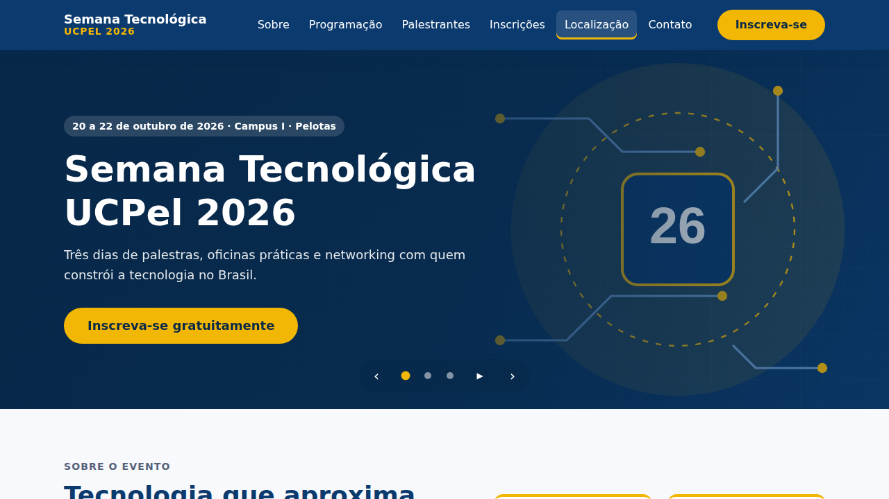
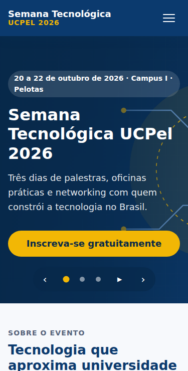
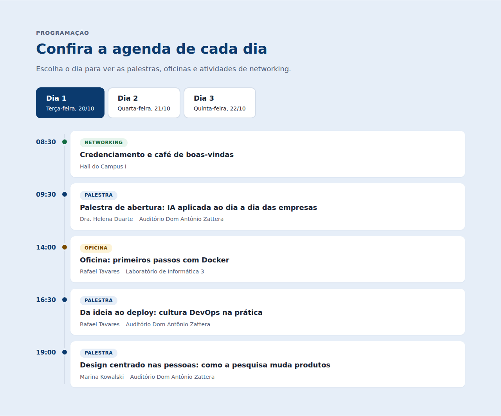
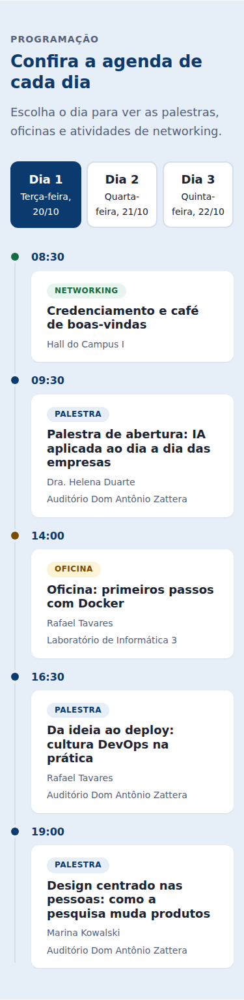
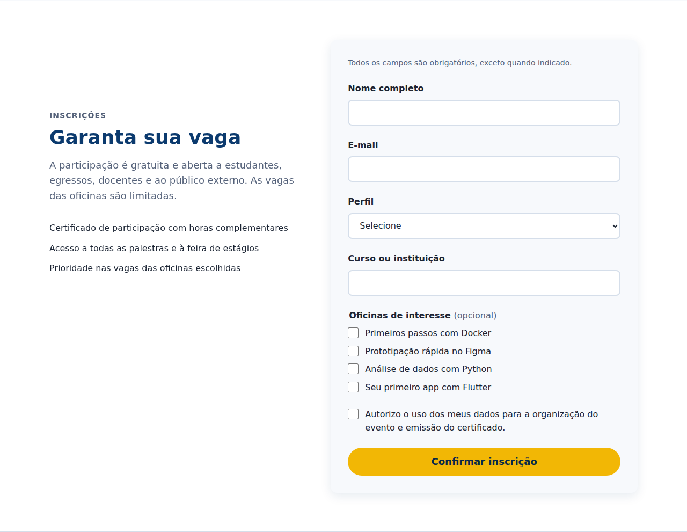
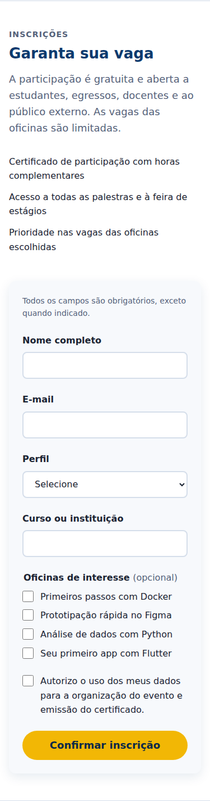
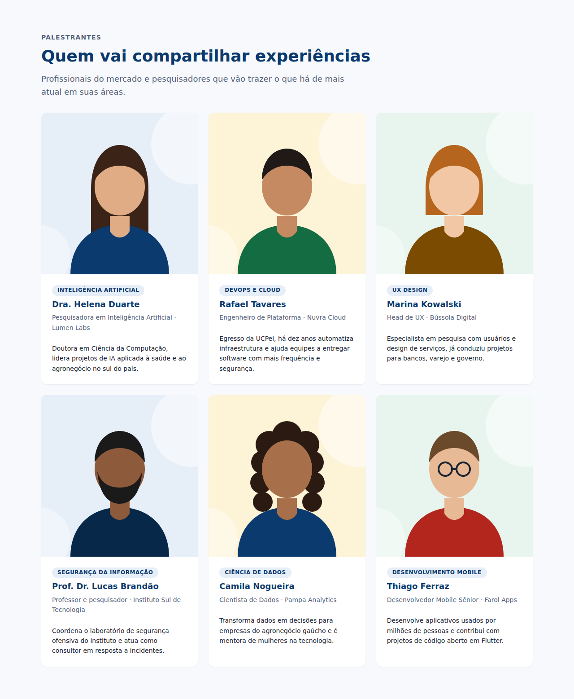
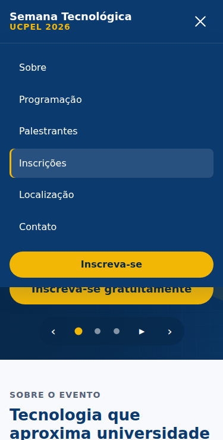

# Semana Tecnológica UCPel 2026 — Landing Page

Landing page institucional e responsiva da **Semana Tecnológica 2026 da Universidade Católica de Pelotas (UCPel)**.
Ela reúne em um único endereço a apresentação do evento, a programação por dia, os palestrantes, as oficinas, a inscrição, a localização e os canais de contato.

> **Dados ilustrativos:** a programação oficial de 2026 ainda não foi divulgada. Palestrantes, empresas, datas e salas são fictícios e aparecem sinalizados na página.

🔗 **Página publicada:** https://joanamespaque.github.io/ucpel-pi-iv-a/

---

## Sumário

- [Sobre o projeto](#sobre-o-projeto)
- [Funcionalidades](#funcionalidades)
- [Tecnologias](#tecnologias)
- [Estrutura de pastas](#estrutura-de-pastas)
- [Como executar localmente](#como-executar-localmente)
- [Modelagem](#modelagem)
- [Fluxo de desenvolvimento](#fluxo-de-desenvolvimento)
- [Acessibilidade](#acessibilidade)
- [Testes realizados](#testes-realizados)
- [Capturas de tela](#capturas-de-tela)
- [Equipe](#equipe)
- [Referências](#referências)
- [Licença](#licença)

---

## Sobre o projeto

Projeto integrador das disciplinas de **Engenharia de Software** e **Ferramentas de Desenvolvimento Web**, do curso de **Análise e Desenvolvimento de Sistemas** da UCPel.

A página usa como referência a página da edição anterior do evento e melhora três pontos:

- a **hierarquia visual** do conteúdo;
- a **fluidez da navegação** entre as seções;
- o **destaque dos botões de chamada para ação (CTA)**, que levam o visitante à inscrição.

**Público-alvo:** estudantes de graduação da UCPel, egressos, docentes e público externo interessado em tecnologia.

## Funcionalidades

- Menu fixo com os itens Início, Sobre o evento, Programação, Palestrantes, Oficinas, Inscrições, Localização e Contato, colapsável abaixo de 1280 px
- Slideshow com 3 destaques do evento (troca automática, controles e botão de pausa)
- Programação em formato de linha do tempo, navegável por dia
- Cards com o perfil dos palestrantes
- Cards das oficinas com vagas disponíveis, carga horária, pré-requisitos e o que levar; o botão "Quero participar" já marca a oficina no formulário
- Formulário de inscrição com validação e código de inscrição (ST26-XXXX) na confirmação
- Mapa do campus incorporado
- Seção de contato com os canais oficiais da UCPel e perguntas frequentes
- Rodapé com informações institucionais, links úteis e redes sociais oficiais da UCPel
- Layout responsivo para mobile, tablet e desktop

## Tecnologias

| Tecnologia | Uso |
|---|---|
| HTML5 | Estrutura semântica da página |
| CSS3 | Layout com Grid e Flexbox, design tokens com Custom Properties, abordagem mobile-first |
| JavaScript (ES Modules) | Modelo de dados, renderização dinâmica e interatividade |
| Git e GitHub | Versionamento do código |
| GitHub Pages | Publicação da página |

O projeto não tem etapa de build nem dependências: os arquivos são servidos exatamente como estão no repositório.

## Estrutura de pastas

```
ucpel-pi-iv-a/
├── index.html              # Página principal
├── assets/
│   ├── css/
│   │   ├── reset.css       # Normalização entre navegadores
│   │   ├── variables.css   # Design tokens (cores, tipografia, espaçamentos)
│   │   ├── base.css        # Estilos globais e tipografia
│   │   ├── layout.css      # Header, seções e footer
│   │   ├── components.css  # Botões, cards, timeline, abas, slideshow e formulário
│   │   └── responsive.css  # Ajustes por breakpoint
│   ├── js/
│   │   ├── data.js         # Classes Event, Speaker, Activity e Workshop + dados do evento
│   │   ├── render.js       # Renderização das seções a partir do modelo
│   │   ├── nav.js          # Menu mobile e link ativo
│   │   ├── slideshow.js    # Slideshow do hero
│   │   ├── schedule.js     # Abas da programação
│   │   ├── form.js         # Validação do formulário e pré-seleção de oficinas
│   │   └── main.js         # Ponto de entrada
│   └── img/                # Ilustrações, avatares e favicon (SVG)
├── docs/
│   └── screenshots/        # Capturas de tela para o relatório
├── .editorconfig
├── .gitignore
└── README.md
```

## Como executar localmente

```bash
git clone https://github.com/joanamespaque/ucpel-pi-iv-a.git
cd ucpel-pi-iv-a
python3 -m http.server 8000
```

Depois, acesse <http://localhost:8000>.
Como o projeto usa ES Modules, é preciso abrir a página por um servidor local: o `python3 -m http.server` acima ou a extensão **Live Server** do VS Code. Abrir o `index.html` direto no navegador não funciona.

## Modelagem

**Casos de uso** (ator: Visitante)

| Caso de uso | Onde está na página |
|---|---|
| Consultar Programação | Seção *Programação* (abas por dia) |
| Visualizar Palestrantes | Seção *Palestrantes* (cards) |
| Consultar Oficinas | Seção *Oficinas* (cards com vagas e botão "Quero participar") |
| Realizar Inscrição | Seção *Inscrições* (formulário) |
| Buscar Localização | Seção *Localização* (endereço e mapa) |
| Entrar em Contato | Seção *Contato* (canais oficiais e perguntas frequentes) e rodapé |

**Diagrama de classes → código**

As classes do domínio estão implementadas em [`assets/js/data.js`](assets/js/data.js). O código segue o padrão do projeto: identificadores em inglês e conteúdo exibido em português.

| Classe (UML) | Classe (código) | Método (UML → código) |
|---|---|---|
| Evento | `Event` | `getResumo()` → `getSummary()` |
| Palestrante | `Speaker` | `exibirCard()` → `renderCard()` |
| Atividade | `Activity` | `exibirNaAgenda()` → `renderScheduleItem()` |
| Oficina | `Workshop` (herda de `Activity`) | `temVagas()` → `hasSeats()`, `exibirCard()` → `renderCard()` |

Um `Event` *possui* vários `Speaker` (agregação, `event.speakers`) e é *composto* por várias `Activity` (composição, `event.activities`). `Workshop` é uma especialização de `Activity` com vagas limitadas; `event.workshops` retorna só as oficinas.

## Fluxo de desenvolvimento

| Branch | Finalidade |
|---|---|
| `main` | Versão estável, publicada no GitHub Pages |
| `develop` | Integração do desenvolvimento |

Os commits são feitos **por camada de desenvolvimento** e seguem o padrão [Conventional Commits](https://www.conventionalcommits.org/), em inglês:

| # | Camada | Commit |
|---|---|---|
| 0 | Configuração | `chore: initialize repository with README, .gitignore and .editorconfig` |
| 1 | Estrutura (HTML) | `feat(html): add semantic landing page structure` |
| 2 | Fundação visual (CSS) | `style(base): add reset, design tokens and typography` |
| 3 | Layout (CSS) | `style(layout): implement sticky header, section grids and footer` |
| 4 | Componentes (CSS) | `style(components): style buttons, cards, timeline, tabs, slideshow and form` |
| 5 | Responsividade (CSS) | `style(responsive): adapt layout for mobile, tablet and desktop` |
| 6 | Modelo de dados (JS) | `feat(model): implement Event, Speaker and Activity classes from UML` |
| 7 | Renderização (JS) | `feat(render): render About, Schedule and Speakers sections from model` |
| 8 | Interatividade (JS) | `feat(ui): add mobile menu, slideshow, schedule tabs and form validation` |
| 9 | Mídia e integração | `feat(assets): add illustrations, avatars, favicon, map and SEO metadata` |
| 10 | Acessibilidade | `fix(a11y): apply WCAG 2.2 checklist and best practices` |
| 11 | Documentação | `docs: add screenshots and live link to README` |

Ao fim do desenvolvimento, a `develop` é integrada à `main` por pull request e a versão recebe a tag `v1.0.0`.

**Versão 1.1.0 (entrega final)** — ajustes a partir do Plano de Execução e do feedback da entrega parcial:

| Commit | O que mudou |
|---|---|
| `fix(nav): add Início and Oficinas menu items` | Menu com todos os itens obrigatórios |
| `feat(model): add Workshop class extending Activity` | Classe Oficina do diagrama implementada |
| `feat(workshops): add workshops section with form pre-selection` | Seção de oficinas e integração com o formulário |
| `feat(contact): add contact section and complete the footer` | Seção de contato, FAQ, links úteis e redes sociais |
| `fix(form): replace misleading e-mail confirmation with registration code` | Confirmação honesta, sem prometer e-mail |
| `fix(a11y): meet 3:1 non-text contrast for focus ring and field borders` | Correções do critério WCAG 1.4.11 |
| `docs: flag speakers and schedule as illustrative data` | Aviso de dados ilustrativos |
| `chore: remove unused screenshots from repository root` | Organização do repositório |

## Acessibilidade

A página segue o checklist das **WCAG 2.2**:

- navegação completa por teclado e link "Pular para o conteúdo";
- foco visível em todos os elementos interativos: anel azul nos fundos claros e amarelo nos fundos escuros, ambos com contraste mínimo de 3:1 (1.4.11);
- bordas dos campos do formulário com contraste de 3,5:1 (1.4.11);
- informação de vagas das oficinas em texto e ícone, não só por cor (1.4.1);
- links externos avisam que abrem em nova aba;
- contraste mínimo AA (4.5:1) entre texto e fundo;
- textos alternativos em todas as imagens;
- atributos ARIA no menu, nas abas da programação, no slideshow e nas mensagens do formulário;
- animações desativadas quando o sistema pede movimento reduzido (`prefers-reduced-motion`).

## Testes realizados

**Testes funcionais automatizados** (Playwright + Chromium, em 375 px e 1280 px)

| Cenário | Resultado |
|---|---|
| Renderização dos 6 cards de palestrantes e das 3 abas da programação a partir do modelo | ✅ |
| Menu com 8 itens, todos apontando para seções existentes | ✅ |
| Oficinas: 4 cards renderizados; oficina esgotada fica desabilitada no formulário | ✅ |
| Oficinas: "Quero participar" marca a oficina no formulário | ✅ |
| Contato: 5 perguntas frequentes e redes sociais com rótulo acessível | ✅ |
| Troca de dia na programação por clique e pelo teclado (setas, Home e End) | ✅ |
| Slideshow: avançar, voltar, indicadores e pausa | ✅ |
| Slideshow sem troca automática quando o sistema pede movimento reduzido | ✅ |
| Formulário: mensagens de erro nos campos obrigatórios e e-mail inválido | ✅ |
| Formulário: confirmação com código ST26-XXXX após envio válido | ✅ |
| Menu mobile: abre, fecha ao escolher um link e fecha com Esc | ✅ |
| Link "Pular para o conteúdo" é o primeiro item focado pelo Tab | ✅ |
| Sem rolagem horizontal em 320, 375, 768, 1024 e 1440 px | ✅ |
| Console do navegador sem erros de JavaScript | ✅ |

**Auditorias**

| Ferramenta | Resultado |
|---|---|
| axe-core (WCAG 2.0, 2.1 e 2.2 A/AA + boas práticas) | 0 violações em desktop e mobile |
| Lighthouse — Acessibilidade | 100 |
| Lighthouse — Boas práticas | 100 |
| Lighthouse — SEO | 100 |
| Lighthouse — Desempenho (simulação mobile) | 86 |
| html-validate | Sem erros |

Os testes da versão 1.1.0 foram refeitos com Playwright + axe-core (0 violações em 1280 px e 375 px) e html-validate. Os resultados do Lighthouse são da versão 1.0.0.

## Capturas de tela

| Desktop | Mobile |
|---|---|
|  |  |
|  |  |
|  |  |
|  |  |

Outras capturas: [sobre o evento](docs/screenshots/desktop-about.png) e [rodapé](docs/screenshots/desktop-contact.png).

## Equipe

- Joana Mespaque Borges

## Referências

- BROOKSHEAR, J. G. *Ciência da computação: uma visão abrangente*. 11. ed. Porto Alegre: Bookman, 2013.
- MACHADO, R. P.; FRANCO, M. I.; BERTAGNOLLI, S. C. *Desenvolvimento de software III: programação de sistemas web orientada a objetos em Java*. Porto Alegre: Bookman, 2016.
- PRESSMAN, R. S.; MAXIM, B. R. *Engenharia de software: uma abordagem profissional*. 8. ed. Porto Alegre: McGraw Hill, 2016.
- VALENTE, M. T. *Engenharia de Software Moderna*. Editora Independente, 2020.
- W3C. *Web Content Accessibility Guidelines (WCAG) 2.2*. W3C Recommendation, 2023.

## Licença

Projeto acadêmico, sem fins comerciais. © 2026 — Joana Mespaque Borges, Análise e Desenvolvimento de Sistemas, UCPel.
